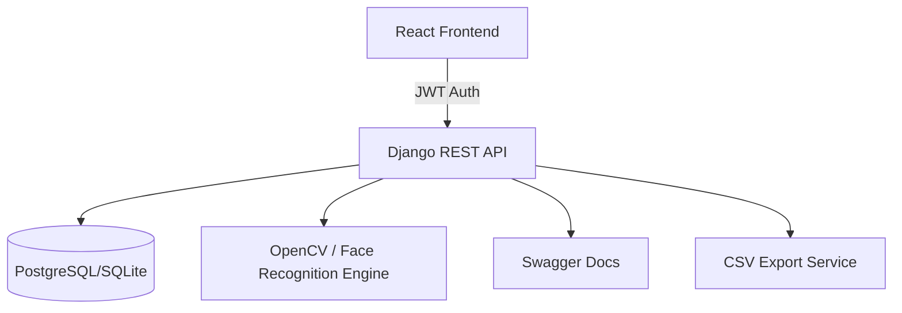

# 🎓 Student Attendance Management System

[](https://github.com/nishanth-kj/Student-Attendance-Management-System/actions/workflows/main.yml)
[](https://opensource.org/licenses/MIT)
[](https://www.djangoproject.com/)
[](https://reactjs.org/)
[](https://www.docker.com/)

A production-ready Student Attendance Management System featuring **Biometric Facial Recognition**, **Role-Based Access Control (RBAC)**, and **Real-time Analytics**. Designed to replace traditional manual attendance with a secure, automated, and scalable digital solution.

---

## ✨ Features

### 👤 User Roles & RBAC
- **Admin**: Full system control - manage faculty, departments, and system audits.
- **Faculty/Staff**: Enroll students, manage classes, and generate attendance reports.
- **Students**: View personal attendance history and real-time check-in status.

### 🤖 Biometric Facial Recognition
- **Automated Marking**: Uses `dlib` and `face-recognition` to identify faces in milliseconds.
- **Biometric Enrollment**: Store high-dimensional face embeddings instead of raw images for privacy.
- **Anti-Spoofing Ready**: Architecture supports integration with liveness detection.

### 📊 Professional Dashboard
- **Real-time Analytics**: Visual trends for attendance rates and punctuality.
- **CSV/PDF Export**: Export logs for academic records or compliance.
- **Mobile Responsive**: Fully functional on tablets and smartphones.

### 🛡️ Secure Infrastructure
- **JWT Auth**: Stateless authentication with access/refresh token rotation.
- **API Documentation**: Automated OpenAPI/Swagger specs via `drf-spectacular`.
- **CI/CD**: Automated testing and Docker build pipelines.

---

## 🏗️ System Architecture



---

## 🛠️ Tech Stack

- **Backend**: Python 3.12, Django 5.0, Django REST Framework
- **Frontend**: React 18, Vite, Tailwind CSS, Framer Motion
- **Database**: PostgreSQL (Prod) / SQLite (Dev)
- **Face Recognition**: OpenCV, dlib, face-recognition
- **DevOps**: Docker, Docker Compose, GitHub Actions, Kubernetes (Manifests included)

---

## 🚀 Getting Started

### Prerequisites
- Python 3.12+
- Node.js 18+
- Docker (optional)

### Quick Start with Docker (Recommended)
```bash
docker-compose up --build
```
The application will be available at:
- **Frontend**: `http://localhost:5173`
- **API**: `http://localhost:8000`
- **Swagger Docs**: `http://localhost:8000/api/docs/`

### Manual Backend Setup
1. `cd django`
2. `pip install -r requirements.txt`
3. `python manage.py migrate`
4. `python manage.py seed_db` (Optional: Seed initial data)
5. `python manage.py runserver`

### Manual Frontend Setup
1. `cd react-app`
2. `npm install`
3. `npm run dev`

---

## 📖 API Documentation

The API is fully documented using Swagger and Redoc. When the server is running, visit:
- **Swagger UI**: `/api/docs/`
- **Redoc**: `/api/redoc/`
- **JSON Schema**: `/api/schema/`

---

## 🧪 Testing

### Backend
```bash
cd django
python manage.py test
```

### Frontend
```bash
cd react-app
npm test
```

---

## 📄 Database Schema

The system uses a custom User model to handle multiple roles and biometric data:
- **User**: `id`, `username`, `email`, `role` (Admin/Staff/Student), `usn`, `face_embedding`.
- **Log**: `id`, `user_id` (FK), `timestamp`.

---

## 🛣️ Roadmap
- [ ] Multi-class / Course scheduling support
- [ ] Email notifications for absence
- [ ] Mobile App (Flutter/React Native)
- [ ] Liveness detection for face recognition

---

## 👥 Contributing
Contributions are welcome! Please open an issue or submit a pull request.

## 📄 License
This project is licensed under the MIT License - see the [LICENSE](LICENSE) file for details.
